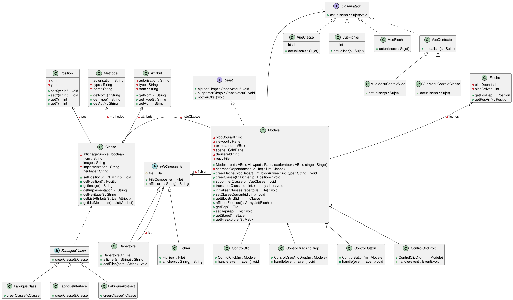
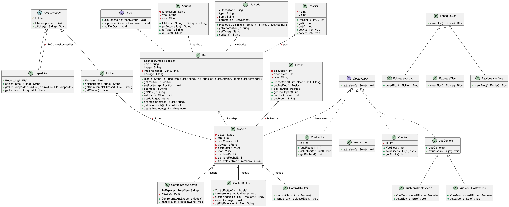
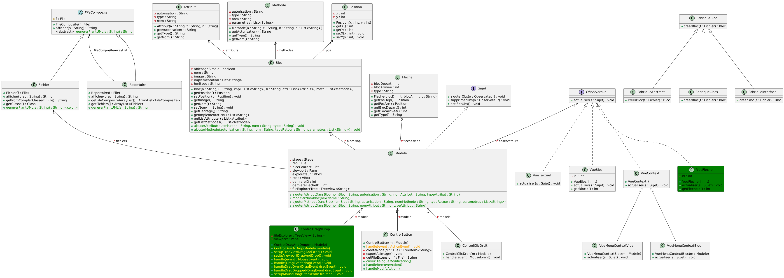

# SAE-3.01-D-veloppement-d-une-application

## Itérations
[Itération 1](iterations/iteration_1/iteration_1.md)   
[Itération 2](iterations/iteration_2/iteration_2.md)
[Itération 2](iterations/iteration_3/iteration_3.md)
## Diagrammes de classe
### Itération 1

### Itération 2

### Itération 3

