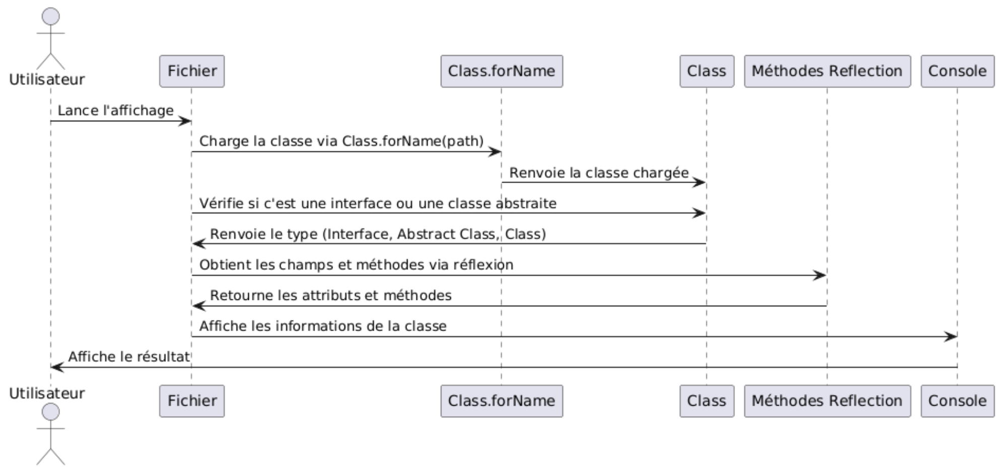

# Itération 1
## Fonctionnalités version 1

- les clics droit
- les menus contextuels
- introspection textuelle
MVC opérationnel

 - code du squelette de toutes les classes
 - implementation des classes :
    - Main
    - Bloc
    - Fleche
    - Attribut
    - Modele
    - Control Button
    - ControlClicDroit
    - Position
    - FabriqueClass
    - FabriqueInterface
    - FabirqueAbstract

- implémentation des classes test :
    - BlocTest
    - ModeleTest

## Fonctionnalités pour la version 2

- Affichage fichier dans l'explorateur 
- commencer à faire l'affichage des diagrammes + drag and drop

## Diagramme de classe

## Diagramme de séquence

