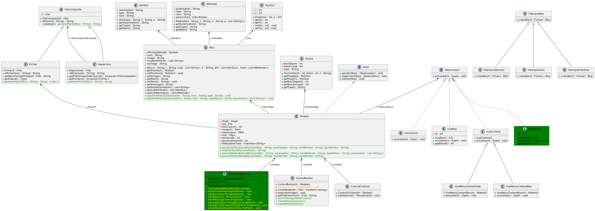

# Iteration 3 #

## Fonctionnalits itération 3 ##

### Manech ###

- Génération PlantUML

### Mathieu ###

- Flèches 

### Emma ###

- ModifierBloc

### Antoine ### 

- DragAndDrop

## Fonctionnalités itération 4 ##

- Créer bloc DragAndDrop
- Page responsive ?
- Flèches 
- ModifierBloc 

Diagramme de Classe

